# 🚛 Smart Municipal Waste Management Backend System

An enterprise-grade, microservices-driven backend platform for **Smart Municipal Solid Waste Management**, **Dynamic Route Optimization (VRP)**, **Real-Time Fleet GPS Telemetry**, **IoT Bin Monitoring**, **AI Vision Waste Verification**, and **Citizen Grievance Redressal**.

---

## 📋 Table of Contents

- [Overview](#-overview)
- [Key Features](#-key-features)
- [System Architecture & Data Flow](#-system-architecture--data-flow)
- [Tech Stack](#-tech-stack)
- [Environment Variables & Secret Keys](#-environment-variables--secret-keys)
- [Database Schema (Supabase)](#-database-schema-supabase)
- [Microservices & Services breakdown](#-microservices--services-breakdown)
  - [Node.js Express API Gateway](#1-nodejs-express-api-gateway)
  - [Python FastAPI VRP Solver (`optimizer-service`)](#2-python-fastapi-vrp-solver-optimizer-service)
  - [OSRM Engine Integration](#3-osrm-engine-integration)
  - [Gemini Vision AI Engine](#4-gemini-vision-ai-engine)
  - [Redis Geospatial Engine](#5-redis-geospatial-engine)
- [API Documentation](#-api-documentation)
- [Prerequisites & System Requirements](#-prerequisites--system-requirements)
- [Step-by-Step Installation & Setup](#-step-by-step-installation--setup)
- [Seeding Database & Running Simulations](#-seeding-database--running-simulations)
- [Project Directory Structure](#-project-directory-structure)

---

## 🌟 Overview

The **Waste Management Backend** solves modern urban sanitation challenges by combining real-time IoT bin fill sensors, machine-learning-driven fleet route optimization, computer vision for complaint verification, and high-frequency live GPS tracking.

It automates garbage collection workflows by calculating **optimal multi-vehicle routes** under vehicle capacity limits and territorial geofences, reducing fuel consumption and operational costs.

---

## ✨ Key Features

1. **AI Vision Complaint Verification**: Integrates Google Gemini 2.5 Flash Vision API to automatically inspect uploaded photos and verify whether solid waste is present, filtering out invalid or unrelated submissions.
2. **Automatic EXIF GPS Extraction**: Reads embedded EXIF metadata from photo uploads to pin precise complaint locations automatically.
3. **Multi-Vehicle VRP Optimization**: Python OR-Tools microservice solving Capacitated Vehicle Routing Problem with soft territory boundary penalties using Guided Local Search & Path Cheapest Arc algorithms.
4. **Real-Time Fleet Telemetry & Geospatial Caching**: High-performance Redis geospatial indexing (`GEOADD`/`GEORADIUS`) and Redis Hashes streaming live vehicle positions at sub-3-second intervals.
5. **OSRM Road Network Routing**: Computes distance/duration matrix tables and precise GeoJSON polylines following real driving road networks.
6. **Smart Priority Calculation Engine**: Dynamic multi-factor scoring (Fill level: 50%, Hours elapsed: 30%, Nearby citizen complaints: 20%) to highlight critical bins.
7. **Collection Verification with Photo Proof**: Driver/Admin collection logging with timestamped proof-of-work photo upload directly to Cloudinary.
8. **Geofenced Fleet Simulation Scripts**: Automated simulation scripts moving collection vehicles strictly along OSRM polylines within designated ward boundaries.

---

## 📐 System Architecture & Data Flow

```mermaid
flowchart TB
    subgraph Clients["Clients & Stakeholders"]
        CitizenApp["📱 Citizen Mobile / Web App"]
        AdminDashboard["💻 Admin Control Center / Fleet Manager"]
        DriverApp["🚛 Driver Mobile App"]
    end

    subgraph Gateway["Express.js API Gateway (Port 5000)"]
        AuthMiddleware["🔐 JWT & Auth Middleware"]
        RouteController["🗺️ Route Controller"]
        ComplaintController["⚠️ Complaint Controller"]
        BinController["🗑️ Bin Controller"]
        CollectionController["📦 Collection Controller"]
        VehicleController["🚛 Vehicle Controller"]
    end

    subgraph Microservices["Microservices & External Engines"]
        FastAPIOptimizer["⚡ Python FastAPI OR-Tools Solver (Port 8000)\n/solve-vrp"]
        OSRMEngine["🛣️ OSRM Engine (Port 5001)\nTable & Route Polylines"]
        GeminiAI["🧠 Google Gemini 2.5 Flash AI Vision"]
        CloudinaryService["☁️ Cloudinary Storage"]
    end

    subgraph DataLayer["Databases & Caches"]
        SupabaseDB[("⚡ Supabase PostgreSQL\n(Bins, Vehicles, Complaints, Admins, Citizens)")]
        RedisCache[("🔴 Redis In-Memory Geospatial Store\n(vehicle:locations GEO & Hashes)")]
    end

    CitizenApp -->|1. Submit Complaint + Photo| ComplaintController
    ComplaintController -->|Extract EXIF GPS| Gateway
    ComplaintController -->|2. Verify Image| GeminiAI
    ComplaintController -->|3. Store Photo| CloudinaryService
    ComplaintController -->|4. Save Record| SupabaseDB

    AdminDashboard -->|Trigger Fleet Optimization| RouteController
    RouteController -->|Fetch Active Bins & Drivers| SupabaseDB
    RouteController -->|5. Get Matrix| OSRMEngine
    RouteController -->|6. Solve VRP| FastAPIOptimizer
    RouteController -->|7. Get Polylines| OSRMEngine
    RouteController -->|8. Formatted Routes| AdminDashboard

    DriverApp -->|Update Location Stream| VehicleController
    VehicleController -->|Read/Write Live Coordinates| RedisCache
    VehicleController -->|Sync Periodically| SupabaseDB

    CollectionController -->|Log Collection + Photo| SupabaseDB
    CollectionController -->|Upload Proof| CloudinaryService
```



---

## 🛠 Tech Stack

| Layer | Technologies Used |
| :--- | :--- |
| **Core API Gateway** | Node.js (v18+), Express.js (v5.2), ES Modules (`"type": "module"`) |
| **Optimization Microservice** | Python 3.10+, FastAPI (v0.115), Uvicorn, Google OR-Tools (v9.11) |
| **Primary Database** | Supabase (PostgreSQL with Row Level Security) |
| **Geospatial & Cache** | Redis (v6.2+ Node Client) - `GEOADD`, Redis Hashes |
| **Routing Engine** | OSRM (Open Source Routing Machine) |
| **AI Vision & EXIF** | Google GenAI SDK (`@google/genai`), `exif-parser` |
| **Media Storage** | Cloudinary API, Multer (Memory Storage) |
| **Authentication** | JSON Web Tokens (`jsonwebtoken`), `bcryptjs`, Google Auth Library |
| **Logging & Middleware** | Morgan, CORS, Dotenv |

---

## 🔑 Environment Variables & Secret Keys

Create a `.env` file in the root directory and specify the required API keys and connection URLs.

### Root `.env` (Node.js Backend)

```env
# Server Configuration
PORT=5000
FRONTEND_URL=http://localhost:5173

# Supabase Database
SUPABASE_URL=https://your-supabase-project.supabase.co
SUPABASE_ANON_KEY=your_supabase_anon_key
SUPABASE_SERVICE_ROLE_KEY=your_supabase_service_role_key

# Authentication
JWT_SECRET=your_super_secret_jwt_key_here

# AI Vision & Media Services
GEMINI_API_KEY=your_google_gemini_api_key
CLOUDINARY_CLOUD_NAME=your_cloudinary_cloud_name
CLOUDINARY_API_KEY=your_cloudinary_api_key
CLOUDINARY_API_SECRET=your_cloudinary_api_secret

# Microservices URLs
REDIS_URL=redis://localhost:6379
OSRM_URL=http://localhost:5001
OPTIMIZER_URL=http://localhost:8000
```

---

## 🗄 Database Schema (Supabase)

### 1. `admins`
| Column | Type | Description |
| :--- | :--- | :--- |
| `id` | UUID (PK) | Unique Admin ID |
| `full_name` | Text | Admin Name |
| `email` | Text (Unique) | Government/Admin Email |
| `password_hash` | Text | Bcrypt Password Hash |
| `role` | Text | Role (e.g. `Super Admin`, `Fleet Manager`) |
| `created_at` | Timestamp | Account creation timestamp |

### 2. `citizens`
| Column | Type | Description |
| :--- | :--- | :--- |
| `id` | UUID (PK) | Unique Citizen ID |
| `full_name` | Text | Citizen Full Name |
| `email` | Text (Unique) | Citizen Email |
| `password_hash` | Text | Bcrypt Password Hash (Nullable for Google Auth) |
| `google_id` | Text | Google OAuth ID |

### 3. `bins`
| Column | Type | Description |
| :--- | :--- | :--- |
| `id` | UUID (PK) | Unique Smart Bin ID |
| `latitude` | Float | GPS Latitude |
| `longitude` | Float | GPS Longitude |
| `fill_level` | Integer | Fill percentage (0 - 100%) |
| `current_weight_kg` | Integer | Calculated weight in kg |
| `status` | Text | Status (`Normal`, `Warning`, `Critical`) |
| `priority_score` | Integer | Multi-factor urgency score (0 - 100) |
| `ward` | Text | Ward / Location Zone |
| `zone` | Text | Sub-zone identifier |
| `last_collected` | Timestamp | Timestamp of last emptying |
| `assigned_driver_id` | UUID | Foreign Key to `vehicles` |

### 4. `vehicles`
| Column | Type | Description |
| :--- | :--- | :--- |
| `id` | UUID (PK) | Vehicle / Truck ID |
| `driver_name` | Text | Assigned Driver Name |
| `driver_phone` | Text | Driver Contact Phone |
| `driver_avatar` | Text | Driver Profile Image URL |
| `license_plate` | Text | Vehicle Registration Plate |
| `capacity_kg` | Integer | Maximum payload capacity in kg |
| `current_load_kg` | Integer | Current loaded weight in kg |
| `speed` | Float | Vehicle speed in km/h |
| `status` | Text | Vehicle state (`Idle`, `Collecting`, `Maintenance`) |
| `latitude` | Float | Current GPS Latitude |
| `longitude` | Float | Current GPS Longitude |
| `min_lat`, `max_lat` | Float | Territory Geofence Latitude Range |
| `min_lng`, `max_lng` | Float | Territory Geofence Longitude Range |
| `territory_name` | Text | Ward Territory Name |

### 5. `complaints`
| Column | Type | Description |
| :--- | :--- | :--- |
| `id` | UUID (PK) | Complaint ID |
| `citizen_id` | UUID (FK) | Reporting Citizen ID |
| `assigned_driver_id` | UUID (FK) | Assigned Driver ID |
| `latitude`, `longitude` | Float | Issue GPS Location |
| `description` | Text | Citizen / System description |
| `image_url` | Text | Uploaded complaint photo URL |
| `resolved_image_url` | Text | Driver/Admin resolution proof photo |
| `status` | Text | Status (`Open`, `Assigned`, `Resolved`) |
| `priority` | Text | Urgency level (`High`, `Medium`, `Low`) |
| `category` | Text | AI Category (`Overflowing Bin`, `Roadside Litter`, etc.) |
| `ai_confidence` | Float | AI model confidence score |
| `ai_reason` | Text | AI classification explanation |
| `gps_source` | Text | Location source (`EXIF_METADATA`, `USER_PIN`) |
| `resolution_notes` | Text | Notes added upon resolution |

### 6. `collections`
| Column | Type | Description |
| :--- | :--- | :--- |
| `id` | UUID (PK) | Collection Log ID |
| `bin_id` | UUID (FK) | Emptied Bin ID |
| `vehicle_id` | UUID (FK) | Driver Vehicle ID |
| `before_level` | Integer | Fill percentage before collection |
| `after_level` | Integer | Fill percentage after collection (0%) |
| `verification_photo_url` | Text | Proof photo URL |
| `timestamp` | Timestamp | Collection timestamp |

---

## ⚙️ Microservices & Services Breakdown

### 1. Node.js Express API Gateway
Acts as the central router for all client applications, enforcing authentication middleware (`verifyAdmin`, `verifyCitizen`), handling multipart uploads, caching vehicle telemetry via Redis, and querying Supabase.

### 2. Python FastAPI VRP Solver (`optimizer-service`)
Located in `./optimizer-service`. Uses **Google OR-Tools** `pywrapcp.RoutingModel` to construct multi-vehicle routes:
- **Territory Penalties**: Bins outside a vehicle's assigned bounding box receive a soft penalty of $+1,000,000$ meters to enforce driver ward ownership.
- **Capacity Dimension**: Ensures no route exceeds `capacity - currentLoad`.
- **Search Strategy**: `PATH_CHEAPEST_ARC` with `GUIDED_LOCAL_SEARCH` metaheuristics.

### 3. OSRM Engine Integration
Communicates with Open Source Routing Machine to:
- Generate distance and duration matrices (`/table/v1/driving`).
- Return road-matched GeoJSON `LineString` geometries and turn-by-turn steps (`/route/v1/driving`).

### 4. Gemini Vision AI Engine
Processes images via `GoogleGenAI` model `gemini-2.5-flash`:
- Verifies solid waste presence (returns strict JSON: `isGarbage`, `category`, `confidence`, `reason`).
- Fallback: Gracefully handles API spikes (503) by flagging reports for manual review without crashing.

### 5. Redis Geospatial Engine
- Caches live positions in `vehicles:locations` using `GEOADD`.
- Stores detailed truck telemetry in Redis Hashes `vehicle:<id>` for fast, low-latency API retrieval without hammering the relational database.

---

## 📡 API Documentation

### 🔐 Auth Routes
| Method | Endpoint | Access | Description |
| :--- | :--- | :--- | :--- |
| `POST` | `/api/auth/citizen/signup` | Public | Register a new citizen account |
| `POST` | `/api/auth/citizen/login` | Public | Citizen login (returns JWT) |
| `POST` | `/api/auth/citizen/google` | Public | Authenticate citizen via Google OAuth token |
| `POST` | `/api/auth/admin/signup` | Public / Admin | Register a new municipal admin |
| `POST` | `/api/auth/admin/login` | Public | Admin login (returns JWT) |

### 🗑 Bin Management Routes
| Method | Endpoint | Access | Description |
| :--- | :--- | :--- | :--- |
| `GET` | `/api/bins` | Public | Get all bins (Filterable by `status`, `ward`) |
| `GET` | `/api/bins/:id` | Public | Get single bin details |
| `POST` | `/api/bins` | Admin | Create a new bin |
| `PUT` | `/api/bins/:id` | Admin | Update bin details / fill level |
| `DELETE` | `/api/bins/:id` | Admin | Remove a bin |
| `POST` | `/api/bins/simulate-telemetry` | Public / Cron | Simulate IoT fill level updates |
| `POST` | `/api/bins/reset-simulation` | Admin | Reset bins to baseline mock data |

### 🚛 Vehicle & Tracking Routes
| Method | Endpoint | Access | Description |
| :--- | :--- | :--- | :--- |
| `GET` | `/api/vehicles` | Public | Fetch real-time vehicle positions from Redis |
| `GET` | `/api/vehicles/:id` | Public | Fetch live telemetry for a single truck |
| `GET` | `/api/tracking/assigned-drivers` | Public | Fetch active drivers assigned to open complaints |

### 🗺 Route Optimization Routes
| Method | Endpoint | Access | Description |
| :--- | :--- | :--- | :--- |
| `POST` | `/api/routes/optimize-fleet` | Admin | Triggers VRP optimization & returns road polylines |

### ⚠️ Complaint Routes
| Method | Endpoint | Access | Description |
| :--- | :--- | :--- | :--- |
| `POST` | `/api/complaints` | Citizen | Submit complaint with photo (AI + EXIF GPS) |
| `GET` | `/api/complaints/my-complaints` | Citizen | View submitted complaints for logged-in citizen |
| `GET` | `/api/complaints/admin/all` | Admin | View all citizen complaints |
| `PATCH` | `/api/complaints/:id/assign` | Admin | Assign a driver to a complaint |
| `PATCH` | `/api/complaints/:id/status` | Admin | Update status & upload resolution proof photo |

### 📦 Collection Verification Routes
| Method | Endpoint | Access | Description |
| :--- | :--- | :--- | :--- |
| `POST` | `/api/collections` | Admin | Log bin collection, upload proof, reset fill level to 0% |
| `GET` | `/api/collections` | Admin | View history of collection logs |

---

## 📦 Prerequisites & System Requirements

Ensure the following tools are installed on your environment:

1. **Node.js**: `v18.0.0` or higher
2. **Python**: `3.10` or higher
3. **Redis Server**: Installed locally or accessible via URL (`redis://localhost:6379`)
4. **Supabase Account**: PostgreSQL database instance with API credentials
5. **OSRM Engine**: Running locally (Port `5001`) or remote OSRM server
6. **Cloudinary Account**: Cloud name, API Key, and API Secret
7. **Google Gemini API Key**: Enabled for Gemini 2.5 Flash

---

## 🚀 Step-by-Step Installation & Setup

### 1. Clone the Repository

```bash
git clone https://github.com/victor-02-var/garabge_backend.git
cd garabge_backend
```

### 2. Install Node.js Dependencies

```bash
npm install
```

### 3. Set Up & Start Python Optimizer Service

```bash
# Navigate to the optimizer service directory
cd optimizer-service

# Create a virtual environment (Optional but recommended)
python -m venv venv
# On Windows:
venv\Scripts\activate
# On Linux/macOS:
source venv/bin/activate

# Install Python requirements
pip install -r requirements.txt

# Start FastAPI server on Port 8000
uvicorn main:app --host 0.0.0.0 --port 8000 --reload
```

### 4. Configure Environment Variables

Create a `.env` file in the root directory (refer to the [Environment Variables](#-environment-variables--secret-keys) section).

### 5. Start Redis Server

Make sure your Redis server is running locally on port `6379`:

```bash
redis-server
```

### 6. Start the Main Express Gateway Server

```bash
# From the root directory:
npm start
```

*Server will launch on `http://localhost:5000`.*

---

## 🌱 Seeding Database & Running Simulations

The repository includes helper scripts to seed initial data into Supabase/Redis and simulate real-time fleet movement.

### 1. Seed Admin Credentials

Creates default municipal admin users in Supabase (`admins` table):

```bash
node seed.js
```

### 2. Seed Fleet Vehicles & Sync to Redis

Populates 8 collection trucks with driver info and syncs coordinates to Redis:

```bash
node seedVehicles.js
```

### 3. Seed Geofenced Ward Dustbins

Generates territory dustbins and unassigned outlier bins:

```bash
node seedBins.js
```

### 4. Run Strict Geofenced Fleet Simulation

Simulates truck movement strictly along OSRM polylines within ward boundaries and updates Redis telemetry every 2.5 seconds:

```bash
node scripts/simulateFleetMovement.js
```

---

## 📂 Project Directory Structure

```
garabge_backend/
├── optimizer-service/             # Python FastAPI OR-Tools Microservice
│   ├── main.py                    # FastAPI route handler (/solve-vrp)
│   ├── optimizer.py               # OR-Tools VRP solver implementation
│   └── requirements.txt           # Python package dependencies
├── scripts/                       # Background Jobs & Fleet Simulators
│   └── simulateFleetMovement.js   # Geofenced truck movement loop
├── src/                           # Express.js Application Source
│   ├── app.js                     # Gateway Entry Point & Middleware setup
│   ├── config/                    # External Service Connections
│   │   ├── cloudinary.js          # Cloudinary & Multer configuration
│   │   ├── redis.js               # Redis client connection setup
│   │   └── supabase.js            # Supabase JS client initialization
│   ├── controllers/               # Express Request Handlers
│   │   ├── authAdminController.js
│   │   ├── authCitizenController.js
│   │   ├── binController.js
│   │   ├── collectionController.js
│   │   ├── complaintController.js
│   │   ├── driverTrackingController.js
│   │   ├── routeController.js
│   │   └── vehicleController.js
│   ├── middleware/                # Custom Middlewares
│   │   ├── authMiddleware.js      # JWT Citizen & Admin Verification
│   │   └── errorHandler.js        # Global Error Handling Middleware
│   ├── routes/                    # API Endpoints Router Definitions
│   │   ├── authAdminRoutes.js
│   │   ├── authCitizenRoutes.js
│   │   ├── binRoutes.js
│   │   ├── collectionRoutes.js
│   │   ├── complaintRoutes.js
│   │   ├── routeRoutes.js
│   │   ├── trackingRoutes.js
│   │   └── vehicleRoutes.js
│   ├── services/                  # Business Logic & Integrations
│   │   ├── imageService.js        # Gemini Vision AI & EXIF GPS Extractor
│   │   ├── optimizerService.js    # Client for Python FastAPI Solver
│   │   └── osrmService.js         # Client for OSRM Distance Matrix & Routes
│   └── utils/                     # Utility Helper Functions
│       ├── mockBinGenerator.js
│       ├── mockVehicleGenerator.js
│       └── priorityEngine.js      # Dynamic Bin Priority Scoring Engine
├── seed.js                        # Admin Seeding Script
├── seedBins.js                    # Ward Dustbin Seeding Script
├── seedVehicles.js                # Fleet Vehicles Seeding Script
├── simulateVehicles.js            # GPS Telemetry Simulation Script
├── package.json                   # Project Dependencies & Scripts
└── README.md                      # Comprehensive Documentation
```

---

## 🤝 Contributing

Contributions, issues, and feature requests are welcome! Feel free to check the repository issues or open a pull request.

---

## 📄 License

This project is licensed under the **ISC License**.
